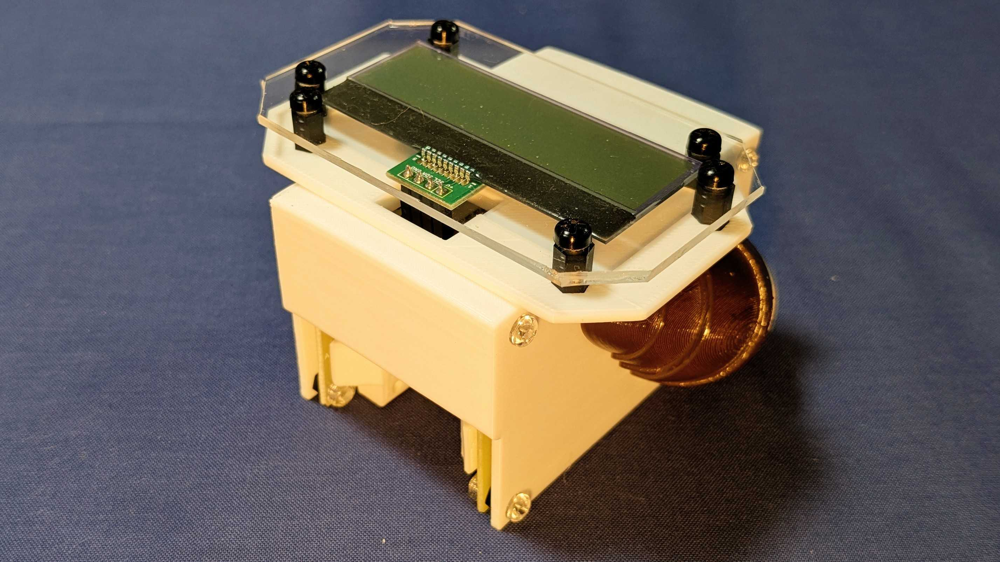
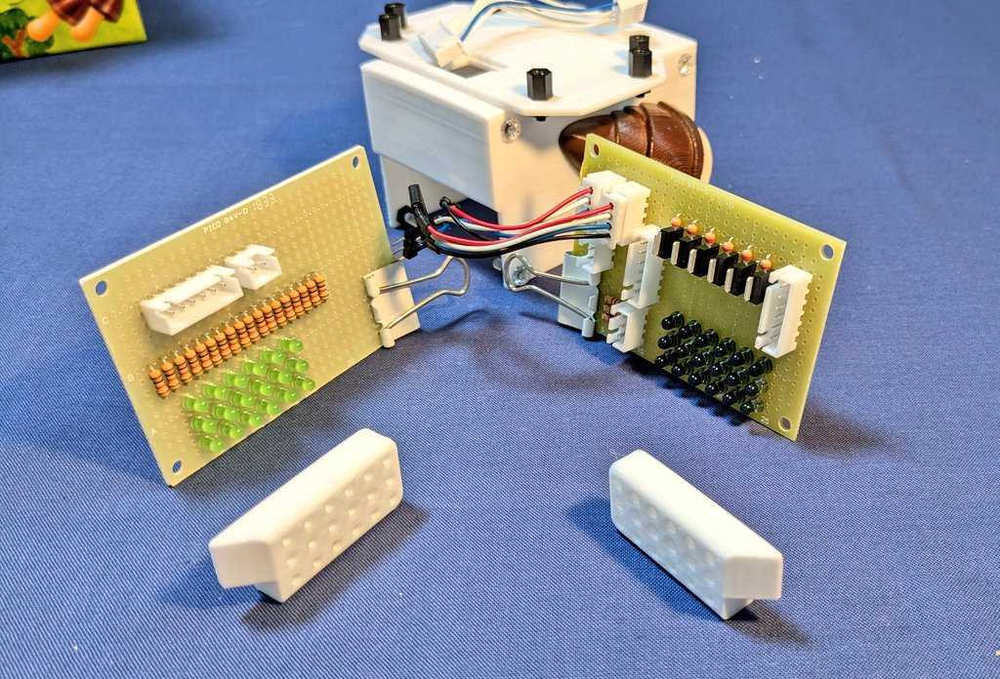
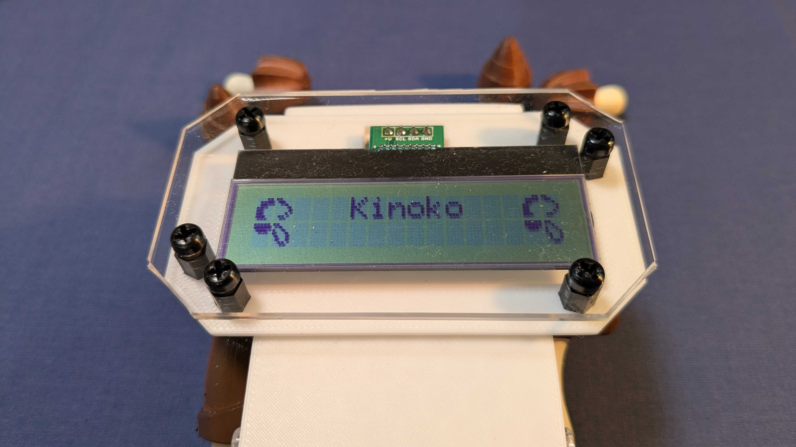
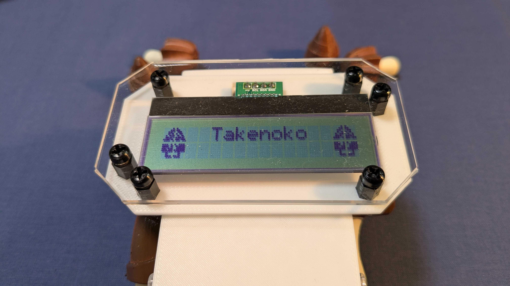

# yorisugu-Leafony

MCPC主催 第6回ナノコン応用コンテスト応募作品(最優秀賞)  

  

---

選りすぐLeafony  

近年、農業や製造業の現場では、形状認識のためにAIによる画像認識の導入が進んでいます。しかし、多くのシステムは高解像度カメラやGPU搭載コンピュータを必要とし、導入コストや消費電力が障壁となっています。  

本プロジェクトでは、LEDと光センサを用いて取得した「シルエット情報(透過光の強度パターン)」のみで物体を識別する、低コスト・省電力な認識手法を提案します。カメラや画像処理を使わず、マイコン1つで処理が完結するため、非常に低い消費電力で動作します。  

概念実証として、明治製菓の「きのこの山」と「たけのこの里」を分類するデモ装置を製作し、日常的な題材を通じて技術の可能性を示しました。  

## 省電力化への取り組み

### 設計思想  
本システムではAI推論をマイコン(ATmega328P 3.3V 8MHz)上で行うことで、PCやGPUと比較して圧倒的に低い消費電力(瞬間電力100mW以内)を実現しています。これにより、ボタン電池での駆動が可能です。  

エッジAIは、計算量や精度の関係からロジスティック回帰モデルを採用しています。  

### ハードウェア設計  
マイコン1つと18個のLED/光センサによるシンプルな構成とし、最大瞬間電流を抑えるためにアナログマルチプレクサ機構を採用しています。そのため、1度に電源供給されるLED/光センサは3つで、6回に分けて電源供給されます。  

電源供給はFETで制御し、未使用時は完全に電源遮断することで待機電力を削減しています。  

### ソフトウェア設計  
本概念実証では、ひとまず1秒に1度処理を実行することとし、演算中(約3ms)以外はスリープモードにしています。  

また、シルエット情報内に物体が無いと判断された際は推論をパスし、演算時間を削減しています。  

## 回路図
基板はLED投光用と光センサ受光用の2枚が用意されます。2つの基板は向かい合わせに設置され、間にある対象物のシルエットを取得します。  

光センサ受光用基板  

  

LED投光用基板  

  

## ソフトウェア

`./Leafony_src/print_classification_result`を参照  

## 検証

### 分類結果

実機を使用して取得したデータセットを用いてPC上で正答率を算出した結果と、結果表示画面を以下にまとめます。  

| Class | Precision | Recall | F1-score | Support |
|------:|----------:|--------:|----------:|--------:|
| 0(kinoko_right) | 1.0000 | 0.9896 | 0.9948 | 96 |
| 1(kinoko_left) | 1.0000 | 1.0000 | 1.0000 | 95 |
| 2(takenoko_right) | 0.9897 | 1.0000 | 0.9948 | 96 |
| 3(takenoko_left) | 1.0000 | 1.0000 | 1.0000 | 98 |
| **Accuracy** | — | — | **0.9974** | 385 |
| **Macro avg** | 0.9974 | 0.9974 | 0.9974 | 385 |
| **Weighted avg** | 0.9974 | 0.9974 | 0.9974 | 385 |

  

  

### 演算時間

シルエットデータ取得時間：19.23[ms]  
推論時間：2.98[ms]  

### 消費電流

消費電力(CPUアクティブ)：66.03[mW]  
消費電力(CPUスリープ)：5.64[mW]  