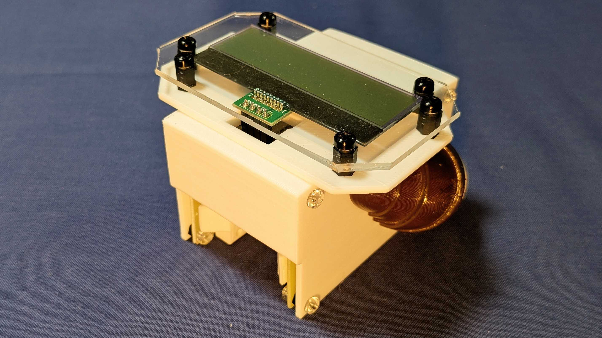
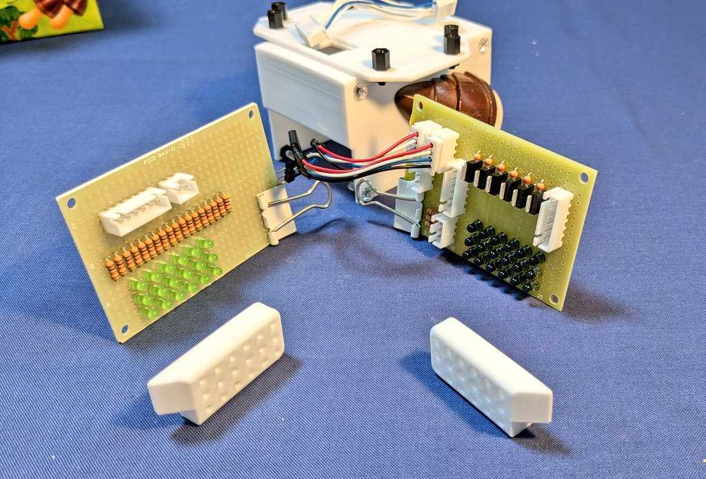
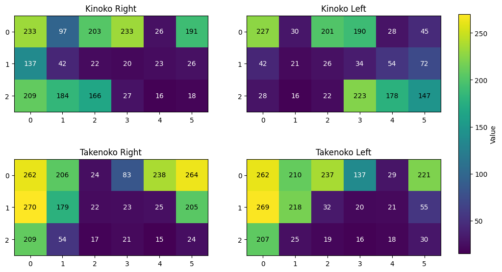
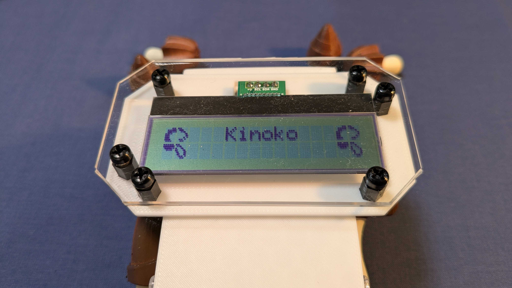
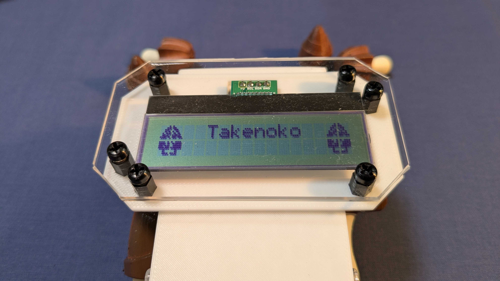

# yorisugu-Leafony

MCPC主催 第6回ナノコン応用コンテスト応募作品（最優秀賞）  

## 特徴
- カメラ不要の物体認識（透過光シルエットのみで識別）
- マイコン単体（ATmega328P）でAI推論（ロジスティック回帰）
- 消費電力70mW以下（ボタン電池駆動可能）

## デモ動画
きのこの山とたけのこの里を分類する様子および技術背景をまとめた動画です。  

- ニコニコ動画: https://www.nicovideo.jp/watch/sm46081919

## 概要

  

選りすぐLeafony  
*A low-power silhouette-based object classifier using Leafony.*  

近年、農業や製造業の現場では、形状認識のためにAIによる画像認識の導入が進んでいます。しかし、多くのシステムは高解像度カメラやGPU搭載コンピュータを必要とし、導入コストや消費電力が障壁となっています。  

本プロジェクトでは、LEDと光センサを用いて取得した「シルエット情報（透過光の強度パターン）」のみで物体を識別する、低コスト・省電力な認識手法を提案します。カメラや画像処理を使わず、マイコン1つで処理が完結するため、非常に低い消費電力で動作します。  

本プロジェクトは概念実証（PoC）として、明治製菓の「きのこの山」と「たけのこの里」を分類するデモ装置を製作し、日常的な題材を通じて技術の可能性を示しました。  

## 省電力化への取り組み

### 設計思想  
本システムではAI推論をマイコン（ATmega328P 3.3V 8MHz）上で行うことで、PCやGPUと比較して圧倒的に低い消費電力（瞬間電力70mW以内）を実現しています。これにより、ボタン電池での駆動が可能です。  

エッジAIは、計算量や精度の関係からロジスティック回帰モデルを採用しています。  

### ハードウェア設計  
マイコン1つと18個のLED/光センサによるシンプルな構成とし、最大瞬間電流を抑えるためにアナログマルチプレクサ機構を採用しています。これにより、1度に電源供給されるLED/光センサは3つで、6回に分けて電源供給されます。  

電源供給はFETで制御し、未使用時は完全に電源遮断することで待機電力を削減しています。  

### ソフトウェア設計  
本概念実証では、ひとまず1秒に1度処理を実行することとし、演算中（約3ms）以外はスリープモードにしています。  
また、シルエット情報内に物体が無いと判断された際は推論をパスし、演算時間を削減しています。  

## 回路図
基板はLED投光用と光センサ受光用の2枚が用意されます。2つの基板は向かい合わせに設置され、間にある対象物のシルエットを取得します。  

光センサ受光用基板  

  

LED投光用基板  

  

## ソフトウェア

[ソースコード](./Leafony_src/print_classification_result/)を参照

シルエットデータの取得、特徴量生成、ロジスティック回帰による推論、LCD表示を行うメイン処理です。

## 検証
本システムの有効性を確認するため、分類精度および処理性能の評価を行いました。

### データ取得
各サンプルは実機を用いて取得し、LED/光センサの出力値を特徴量として各パターンで約100ケースずつ記録しました。  
データは学習用と評価用に分割し、モデルの学習を行っています。

取得したデータをヒートマップにしたものが以下で、目視でもなんとなくお菓子のシルエットが分かります。（数値が小さい方が影）

### 分類結果

実機を使用して取得した[データセット](./Leafony_src/send_sens_val/raw_data/kinoko_takenoko_merged.csv)を用いてPC上で正答率を算出した結果と、結果表示画面を以下にまとめます。  

| Class | Precision | Recall | F1-score | Support |
|------:|----------:|--------:|----------:|--------:|
| 0(kinoko_right) | 1.0000 | 0.9896 | 0.9948 | 96 |
| 1(kinoko_left) | 1.0000 | 1.0000 | 1.0000 | 95 |
| 2(takenoko_right) | 0.9897 | 1.0000 | 0.9948 | 96 |
| 3(takenoko_left) | 1.0000 | 1.0000 | 1.0000 | 98 |
| **Accuracy** | — | — | **0.9974** | 385 |
| **Macro avg** | 0.9974 | 0.9974 | 0.9974 | 385 |
| **Weighted avg** | 0.9974 | 0.9974 | 0.9974 | 385 |

  

  

### 演算時間
シルエット取得と推論を合わせても約22msとなり、ほぼリアルタイムでの分類が可能です。

* シルエットデータ取得時間：19.23[ms]  
* 推論時間：2.98[ms]  

### 消費電流

* 消費電力（CPUアクティブ）：66.03[mW]  
* 消費電力（CPUスリープ）：5.64[mW]  