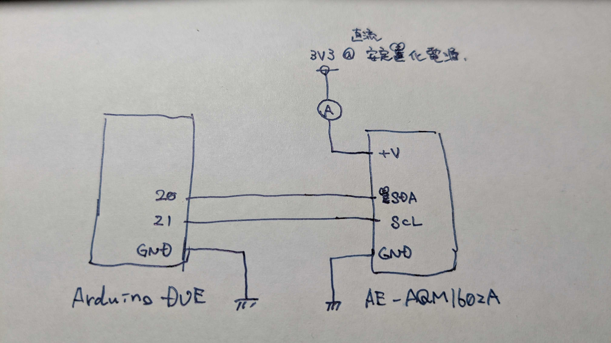
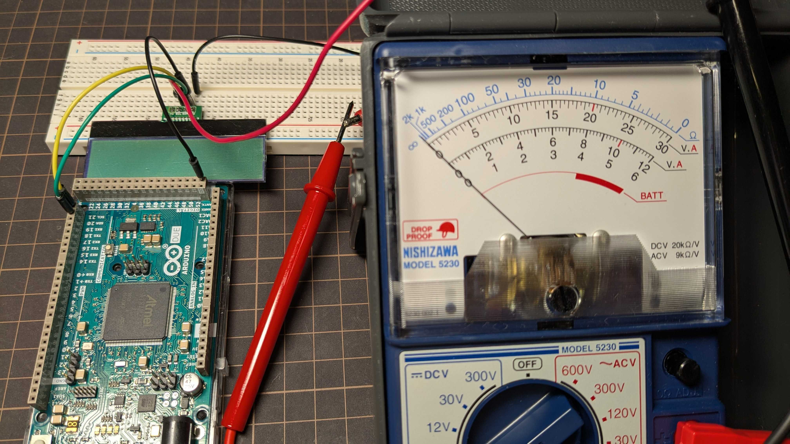
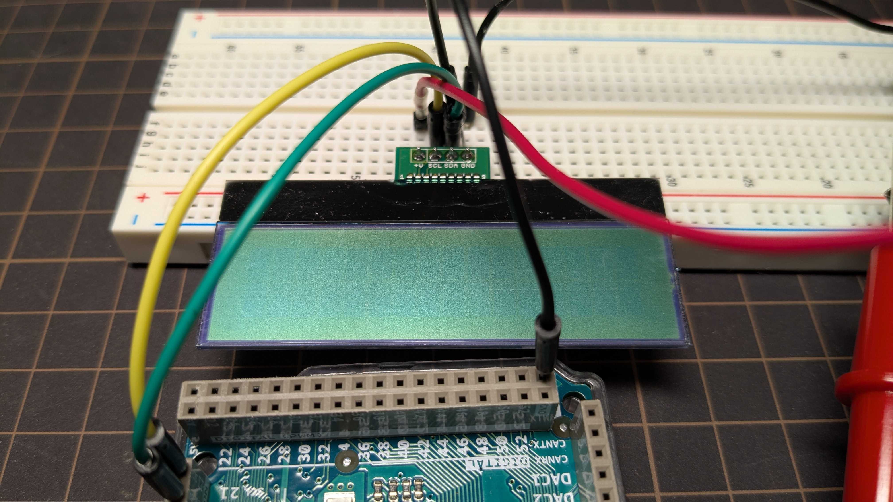
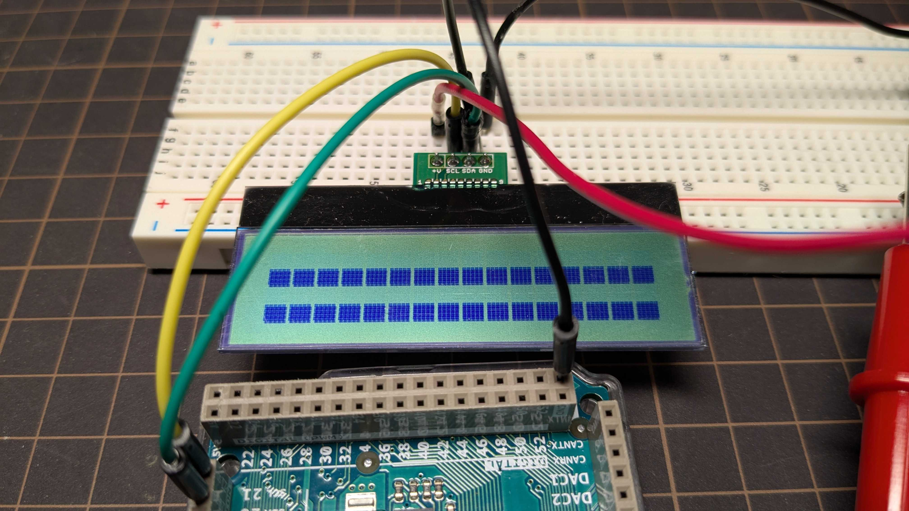
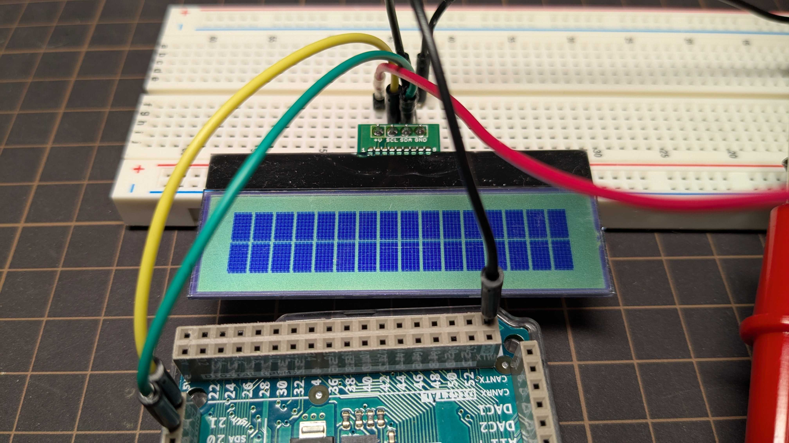
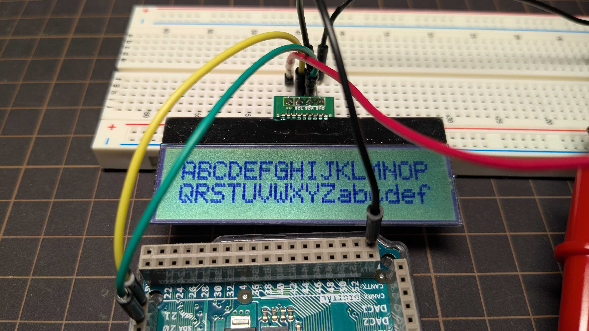
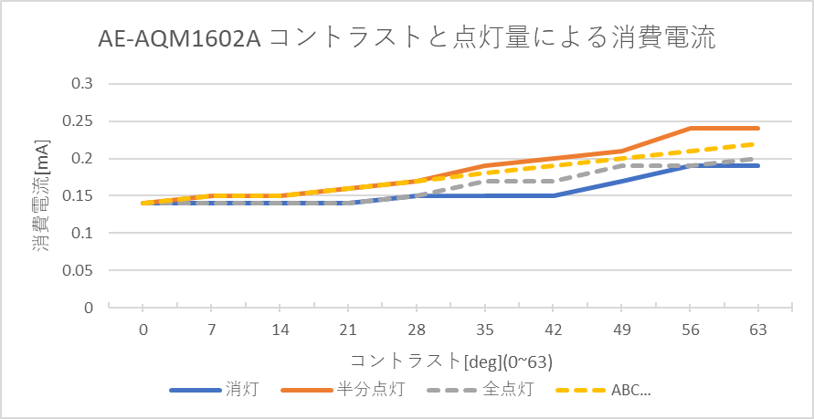

# LCD(AE-AQM1602A)の消費電流を実測してみた

LCD / AE-AQM1602A / Arduino / CR2032 / 電子工作

## 結論

LCD(AE-AQM1602A)の消費電流を計測したところ、0.25[mA]ほどであり、ボタン電池でも十分駆動可能であることが分かりました。  

本記事は、低消費電力で動作するディスプレイを探している電子工作初心者や、省電力IoTデバイス開発者向けの記事です。


## はじめに

前回、ボタン電池でOLEDが駆動できるか確認したが、数十mA以上必要ということが分かり、ボタン電池駆動は出来ないと結論付けた。  

https://qiita.com/TetoraTechLab/items/b2971745c7ca7f4c60e8

そこで、一般的なLCDである「AE-AQM1602A」(1mA@3.3V)を使用しようと考えたのだが、OLEDの件もあり「本当にこんなに電流低いのか...？」と疑心暗鬼となってしまった。そのため、電流を計測してみることにする。  

https://akizukidenshi.com/catalog/g/g108896/


## ハードウェア

試作ではLeafony※と電圧レベルを合わせるために、同じ3.3V出力の「Arduino DUE」を使用している。  



※：Leafonyとは、超小型・低消費電力の電子基板モジュール  

https://docs.leafony.com/docs/overview/#leafony%E3%81%A8%E3%81%AF

使用した電流計(テスター)は以下(3mA計測のレンジを使用)  

https://www.nisic.co.jp/products/electric/multimeter/model-5230-01-%E3%83%86%E3%82%B9%E3%82%BF/


## ソフトウェア

消費電力を計測するにあたり、全部点灯している場合と半分点灯している場合が見たかったため、ユーザ定義の文字を作成しています。  

<details><summary>消費電力計測用のプログラム</summary>

```cpp
#include <Wire.h>
#define LCD_ADRS 0x3E  // AQM1602XA I2Cアドレス

// 表示状態：消灯 → 半分点灯(下) → 全点灯 → 文字サンプル
enum DispState : uint8_t { ALL_OFF = 0, HALF_ON = 1, FULL_ON = 2, CHAR_SAMPLE = 3 };
DispState state = ALL_OFF;

int  contrastVal = 0;    // 0..63, 'c'で+7

// ---- 基本I2C送信 ----
static inline void writeCommand(uint8_t cmd) {
  Wire.beginTransmission(LCD_ADRS);
  Wire.write(0x00);  // Co=0, RS=0
  Wire.write(cmd);
  Wire.endTransmission();
  delay(2);
}
static inline void writeData(uint8_t data) {
  Wire.beginTransmission(LCD_ADRS);
  Wire.write(0x40);  // Co=0, RS=1
  Wire.write(data);
  Wire.endTransmission();
  delay(1);
}

// ---- 初期化 ----
void init_LCD() {
  delay(50);
  writeCommand(0x38);     // Function set
  writeCommand(0x39);     // IS=1
  writeCommand(0x14);     // Bias/OSC (初期は1/5 bias)
  writeCommand(0x70 | (contrastVal & 0x0F));          // Contrast low
  writeCommand(0x5C | ((contrastVal >> 4) & 0x03));   // Contrast high, Icon off, Booster on
  writeCommand(0x6C);     // Follower ON
  delay(200);
  writeCommand(0x38);     // IS=0
  writeCommand(0x0C);     // Display ON
  writeCommand(0x01);     // Clear
  delay(2);
  writeCommand(0x06);     // Entry mode
}

// ---- CGRAM定義 ----
// コード0: 5x8 全点灯
void defineFullOnChar() {
  writeCommand(0x40);     // CGRAM addr = 0（キャラ0）
  for (int i = 0; i < 8; i++) writeData(0x1F);
}

// コード1: 下半分のみ点灯（行4〜7を0x1F、行0〜3は0x00）
void defineHalfOnCharBottom() {
  writeCommand(0x40 | 0x08); // CGRAM addr = 8（キャラ1の先頭）
  for (int i = 0; i < 4; i++) writeData(0x00); // 上半分 消灯
  for (int i = 0; i < 4; i++) writeData(0x1F); // 下半分 点灯
}

// ---- DDRAM全域を指定コードで埋める（16x2） ----
void lcdFillAll(uint8_t code) {
  writeCommand(0x80 | 0x00);
  for (int i = 0; i < 16; i++) writeData(code);
  writeCommand(0x80 | 0x40);
  for (int i = 0; i < 16; i++) writeData(code);
}

// ---- 全消灯（空白で埋め→Clear） ----
void lcdAllOff() {
  lcdFillAll(0x20);   // 空白で埋める（0b0010_0000）
  writeCommand(0x01); // Clear Display（DDRAM全消去＋ホーム）
  delay(2);
}

// ---- 半分点灯（コード1） ----
void lcdHalfOn() {
  lcdAllOff();
  lcdFillAll(0x01); // CGRAM[1]
}

// ---- 全点灯（コード0） ----
void lcdAllOn() {
  lcdAllOff();
  lcdFillAll(0x00); // CGRAM[0]
}

// ---- キャラクタサンプル表示（"ABCDEFGHIJKLMNOP" / "QRSTUVWXYZabcdef"） ----
void lcdCharSample() {
  lcdAllOff();
  const char line1[17] = "ABCDEFGHIJKLMNOP";     // 16文字
  const char line2[17] = "QRSTUVWXYZabcdef";     // 16文字（A..Zの続きに a..f）
  writeCommand(0x80 | 0x00);                     // 1行目先頭
  for (int i = 0; i < 16; i++) writeData(line1[i]);
  writeCommand(0x80 | 0x40);                     // 2行目先頭
  for (int i = 0; i < 16; i++) writeData(line2[i]);
}

// ---- コントラスト設定 ----
void setContrast(int val) {
  val = constrain(val, 0, 63);
  writeCommand(0x39); // IS=1
  writeCommand(0x70 | (val & 0x0F));
  writeCommand(0x5C | ((val >> 4) & 0x03));
  writeCommand(0x38); // IS=0
}

// ---- 状態適用：再描画 ----
void applyState() {
  switch (state) {
    case ALL_OFF:    lcdAllOff();     Serial.println(F("ALL-OFF")); break;
    case HALF_ON:    lcdHalfOn();     Serial.println(F("HALF-ON (bottom half)")); break;
    case FULL_ON:    lcdAllOn();      Serial.println(F("FULL-ON")); break;
    case CHAR_SAMPLE:lcdCharSample(); Serial.println(F("CHAR-SAMPLE (A..Z then a..f)")); break;
  }
}

void setup() {
  Serial.begin(115200);
  Wire.begin();             // Due: SDA=20, SCL=21
  init_LCD();
  defineFullOnChar();
  defineHalfOnCharBottom();
  applyState();    // 初期 ALL_OFF
  Serial.println(F("Ready. 'r': OFF -> HALF -> FULL -> SAMPLE,  'c': Contrast +7"));
}

void loop() {
  if (Serial.available()) {
    char c = Serial.read();
    if (c == 'r' || c == 'R') {
      state = static_cast<DispState>((state + 1) % 4); // OFF→HALF→FULL→SAMPLE→OFF…
      applyState();
    }
    else if (c == 'c' || c == 'C') {
      contrastVal += 7;
      if (contrastVal > 63) contrastVal = 0;
      setContrast(contrastVal);
      Serial.print(F("Contrast = "));
      Serial.println(contrastVal);
    }
  }
}
```

</details>


## 計測結果

### 計測環境

以下の環境で実施した。(実際に計測される方は、導通部分に絶縁テープを貼るなどして、短絡を防止してください。)  



計測は以下の4パターンで計測した。コントラストは0~63の範囲で7刻みで計測した。  

* 消灯



* 半分点灯(ユーザ定義文字)



* 全点灯(ユーザ定義文字)



* 文字サンプル出力




### 電流計測値

以下の通りとなった。何故か半分点灯時の電流が全点灯時の電流よりも大きかったが、最大でも0.25mA以下で、非常に小さな電流で駆動することが分かった。(仕様書に書いてあった1mA@3.3Vを大幅に下回った)

また、ボタン電池(3V)を3.3Vに昇圧して用いることを考慮しても、「ボタン電池の出力電流 = 0.25[mA] * [3.3[V]]/3[V] / 0.8(効率) <= 0.35[mA]」となり、ボタン電池駆動可能と考えられる。  

| コントラスト | 0    | 7    | 14   | 21   | 28   | 35   | 42   | 49   | 56   | 63   | [deg] (MAX：63) | 
| ------------ | ---- | ---- | ---- | ---- | ---- | ---- | ---- | ---- | ---- | ---- | -------------- | 
| 消灯         | 0.14 | 0.14 | 0.14 | 0.14 | 0.15 | 0.15 | 0.15 | 0.17 | 0.19 | 0.19 | [mA]           | 
| 半分点灯     | 0.14 | 0.15 | 0.15 | 0.16 | 0.17 | 0.19 | 0.2  | 0.21 | 0.24 | 0.24 | [mA]           | 
| 全点灯       | 0.14 | 0.14 | 0.14 | 0.14 | 0.15 | 0.17 | 0.17 | 0.19 | 0.19 | 0.20 | [mA]           | 
| ABC…        | 0.14 | 0.15 | 0.15 | 0.16 | 0.17 | 0.18 | 0.19 | 0.20 | 0.21 | 0.22 | [mA]           | 

※：コントラスト14あたりまでは薄すぎて見えない。逆に49を超えると濃すぎて見えない。



## まとめ

Leafonyのコンテストに出すために、ディスプレイを試行錯誤していましたが、このLCDを使用することにします。  
ちなみに、今回はバックライト無しのLCDを使用していますが、バックライトありのLCDですと、バックライト分の電流が上乗せされます。そのため、省電力で用いたい場合はバックライト無しを選択する必要があります。(バックライトはLEDであることが多く、普通に数mA以上流れます。)  